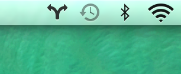

##OSX Setup (From Scratch - Mavericks)

1. **Add Home Directory to the SideBar of Finder**

   - Press `CMD+SHIFT+H` to enter your Home folder in Finder
   - Press `CMD+ArrowUp` to get into the Users folder
   - Drag the folder of your choice to the Sidebar

2. **Install and Setup Divvy**
   - Download Divvy from [http://mizage.com/divvy/](http://mizage.com/divvy/)
   - Click the Divvy icon shown on the upper right of your screen
     
 
3. **Install and activate Hyperdock**
   - Download HyperDock from [http://hyperdock.bahoom.com/](http://hyperdock.bahoom.com/)
   - Activate using `jeffrey.tang09@gmail.com.hdlicense`

2. **Install and Setup iTerm as Guake**


3. **Install brew**

   `ruby -e "$(curl -fsSL https://raw.githubusercontent.com/Homebrew/install/master/install)"`

4. **Packages to install with brew**

   ```bash
   brew install wget
   brew install Caskroom/cask/java
   brew install maven
   brew install tmux
   ```

5. **Install zsh**
 
   - `wget https://raw.github.com/robbyrussell/oh-my-zsh/master/tools/install.sh -O - | sh`
   - Restart Shell to activate zshell

6. **Download PostGres App**
   - Go to [http://postgresapp.com/](http://postgresapp.com/)
   - Click **Download**
   - Double click Postgres.app
   - Add `/Applications/Postgres.app/Contents/Versions/9.4/bin` to your $PATH

7. **Install pip**

   - `sudo easy_install pip`

8. **Pip installs**
 
   See `requirement.txt`
