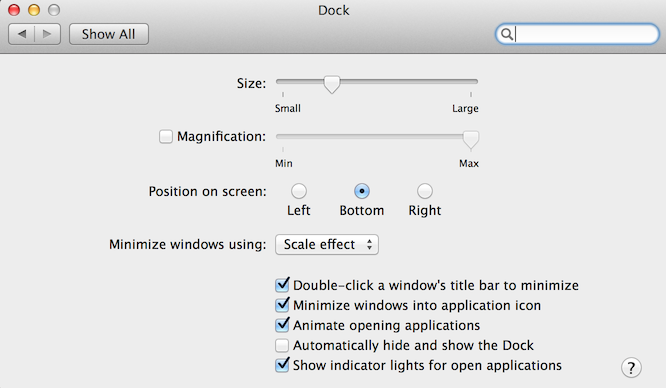

##OSX Setup (From Scratch - Mavericks)

###Index
1. **Add Home Directory to the SideBar of Finder**
2. **Install and Setup Divvy**
3. **Install and activate Hyperdock**
4. **Install XCode Command Line tool**

<br>

1. **Add Home Directory to the SideBar of Finder**

   - Press `CMD+SHIFT+H` to enter your Home folder in Finder
   - Press `CMD+ArrowUp` to get into the Users folder
   - Drag the folder of your choice to the Sidebar

2. **Install and Setup Divvy**
   - Download Divvy from [http://mizage.com/divvy/](http://mizage.com/divvy/)
   - Click the Divvy icon shown on the upper right of your screen
   
     
   - Click the cogwheel icon and then click `License`. Enter the following details:

     ```
     Name:	JeffreyTang
     Code:	GAXAE-F9AXC-M5EAU-UFRKM-RPMMA-NYR9E-8ZPZ9-64JH9-A9KQB-VNRHM-DU6W6-T4Y68-XEPCL-UH76Y-V7B82-H4 
     ``` 
     
3. **Install and activate Hyperdock**
   - Download HyperDock from [http://hyperdock.bahoom.com/](http://hyperdock.bahoom.com/)
   - Activate by double clicking `jeffrey.tang09@gmail.com.hdlicense` in Finder

4. **Dock Settings**
   
   

4. **Install XCode Command Line tool**

   `xcode-select --install`

5. **Install and Setup iTerm as Guake**

   - See [`iterm_setup.md`](iterm_setup.md)

6. **Install gfortran** 

   - Download relevant dmg from [https://gcc.gnu.org/wiki/GFortranBinaries#MacOS](https://gcc.gnu.org/wiki/GFortranBinaries#MacOS)

7. **Install XQuartz**

   - Download the relevant dmg from [http://xquartz.macosforge.org/landing/](http://xquartz.macosforge.org/landing/)

8. **Download PostGres App**
   - Go to [http://postgresapp.com/](http://postgresapp.com/)
   - Click **Download**
   - Double click Postgres.app
   - Add `/Applications/Postgres.app/Contents/Versions/9.4/bin` to your $PATH

9. **Install brew**

   `ruby -e "$(curl -fsSL https://raw.githubusercontent.com/Homebrew/install/master/install)"`

10. **Packages to install with brew**

   ```bash
   brew install wget
   brew install Caskroom/cask/java
   brew install maven
   brew install tmux
   brew install cowsay
   brew install postgis
   brew install osm2pgsql
   brew install graphviz
   brew link --overwrite gcc
   brew tap homebrew/science
   brew install r
   brew install mongodb
   ln -sfv /usr/local/opt/mongodb/*.plist ~/Library/LaunchAgents # Start mongo server on start up
   launchctl load ~/Library/LaunchAgents/homebrew.mxcl.mongodb.plist # Launch mongo server now
   ```

11. **Install zsh**
 
    - `wget https://raw.github.com/robbyrussell/oh-my-zsh/master/tools/install.sh -O - | sh`
    - Restart Shell to activate zshell


12. **Install pip**
    - `sudo easy_install pip`

13. **Pip installs**
 
    ```bash
    sudo pip install -r requirements.txt
    sudo easy_install --upgrade numpy
    sudo pip install pandas
    sudo rm -rf /System/Library/Frameworks/Python.framework/Versions/2.7/Extras/lib/python/scipy
    sudo pip uninstall scipy
    sudo pip install scipy # Should be the lastest scipy
    sudo pip install scikit-image
    sudo pip install scikit-learn
    sudo pip install setuptools --upgrade # have to upgrade setuptools before gensim install
    sudo pip install gensim
    ```

14. **Install Lasagne and Nolearn**
    
    ```bash
    cd ~
    git clone https://github.com/Lasagne/Lasagne.git
    cd Lasagne
    pip install -r requirements.txt
    sudo python setup.py install
    sudo pip install -U -r https://raw.githubusercontent.com/dnouri/kfkd-tutorial/master/requirements.txt
    # Don't delete Lasagne at ~
    ```

15. **Install statsmodels 0.7dev**

    ```bash
    git clone https://github.com/statsmodels/statsmodels.git
    cd statsmodels
    python setup.py build_ext --inplace
    sudo python setup.py install
    ```
    
15. **Python package patches (Run in Python)**
    
    ```python
    import nltk
    nltk.download('all')
    ```
            
15. **Install PyCharm / IntelliJ**
    - Log in [https://account.jetbrains.com/login](https://account.jetbrains.com/login)
    - Download professional versions PyCharm / IntelliJ
    - **Pycharm**
      - `Preferences -> Editor -> General -> Change font size (Zoom) with Ctrl+MouseWheel is enabled`
      - `Preferences -> Editor -> General -> Appearance -> Show line numbers`
      - `Preferences -> Editor -> Color & Font -> Theme`      
      - `Preferences -> Appearance & Behavior -> Appearance -> Theme`
      
